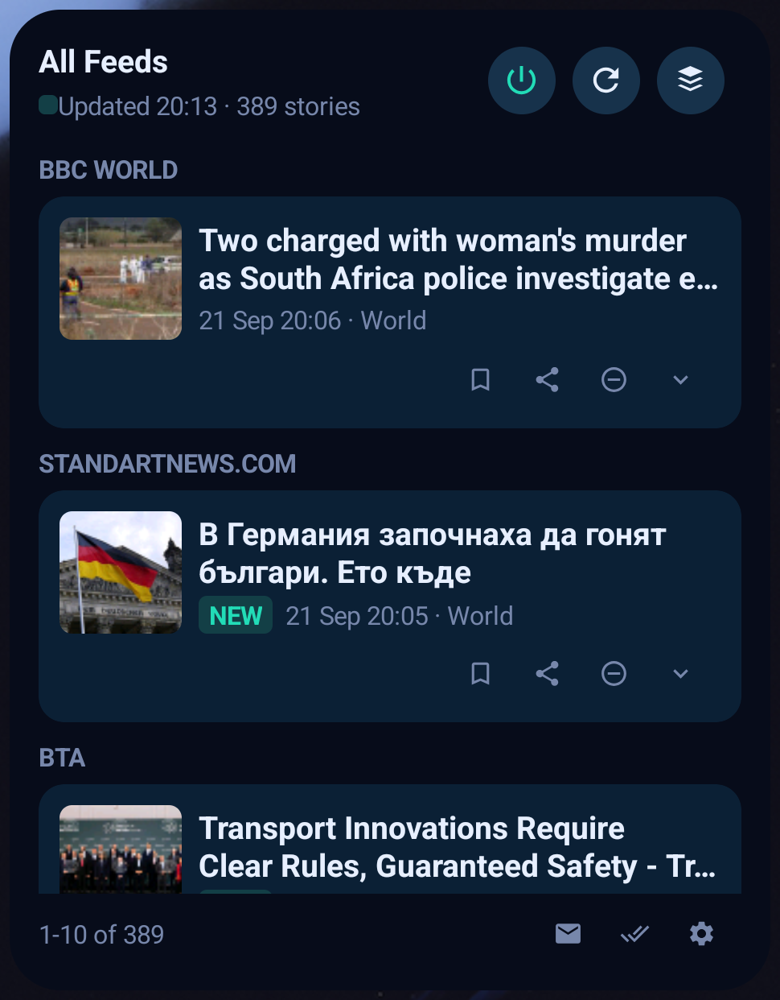
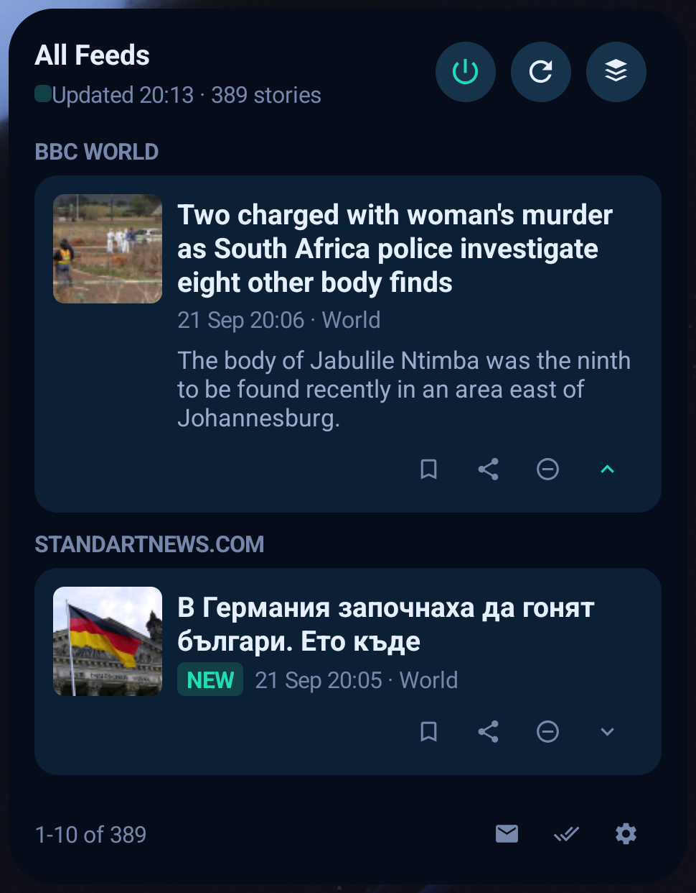
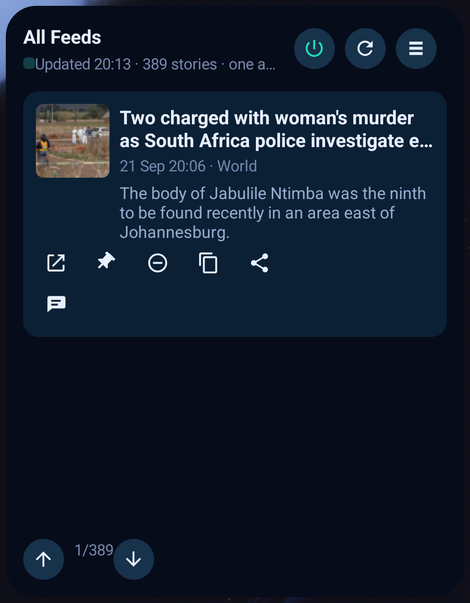

# AI News Android Widget

Native Android implementation of AI News with a real Android home-screen widget.

This repository is intended for the Pixel 9 on-device workflow described in
[`docs/android-native-implementation-plan.md`](docs/android-native-implementation-plan.md).

See [`docs/react-native-migration-plan.md`](docs/react-native-migration-plan.md)
for what a move to React Native would involve.

## The widget

The widget is the product. It pages through the feed ten stories at a time,
keeps its own thumbnails, and every control works without opening the app.

| Ten at a time | A story opened up | One at a time |
| --- | --- | --- |
|  |  |  |

Left: the list, with the page counter, the unread filter, mark-all-read and
settings along the bottom. Middle: a card opened up, so a long headline is not
cut off. Right: stack mode, one story at a time with its own row of actions.

## Goal

- Build a native Android app, not a web wrapper.
- Provide a normal news-reading app experience.
- Add a real Android AppWidget with runtime status, power, refresh, hide, share,
  and story actions.
- Keep the default implementation phone-native, with optional remote backend
  support later.

## Current State

The repository now contains a buildable native Android app under `android/`.

Implemented so far:

- Compose news feed and story detail screen.
- Real Android home-screen widget through Jetpack Glance.
- Visible runtime/fetch status, power, refresh, hide, share, and story actions.
- Room-backed story storage.
- DataStore-backed runtime preferences.
- WorkManager refresh, monitor scan, and auto power-off jobs.
- RSS fetching with `NEW` merge rules and hidden-story preservation.
- Natural-language monitor scanning over titles and summaries, with alert
  pinning in the app and widget.
- Pinned stories that survive refreshes and sort to the top everywhere.
- Per-story AI actions: summary, research, translation, and neutral title, each
  run on its own from the story screen. Widget buttons jump straight to the
  matching block in the app.
- Filtered feed built from keywords, matched on titles and summaries as soon as
  stories arrive. It is also available as a widget feed.
- Saved-story library, separate from pinning.
- Per-feed switches to stop fetching a feed or pause AI for it.
- Fetch history and a sources screen showing which feeds keep failing.
- OPML import and export for the feed list.
- Daily digests with a notification, plus user-defined schedules for refresh,
  monitor scans, and digests.
- AI usage totals by action, pending-story count, and a reset.

## Build

```bash
cd android
gradle :app:assembleDebug
```

## Install

Download the latest debug APK from GitHub Releases, or install a local build:

```bash
adb install -r android/app/build/outputs/apk/debug/app-debug.apk
```

GitHub Actions also uploads `ai-news-debug-apk` on every push to `main`. Version
tags like `v0.1.1-debug` publish `app-debug.apk` to that tag's release.

For Pixel 9 setup and manual widget verification, see
[`docs/pixel-9-verification.md`](docs/pixel-9-verification.md).
